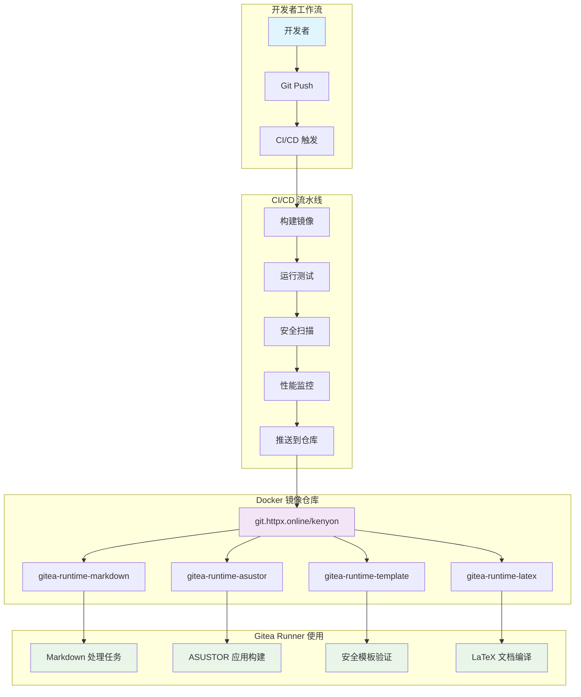

# 项目架构文档

## 整体架构



## 运行时环境架构

### 1. runtime-markdown
```
┌─────────────────────────────────────┐
│         Node.js LTS Alpine          │
├─────────────────────────────────────┤
│  • markdownlint-cli2                │
│  • Python 3                        │
│  • 常用工具 (bash, curl, git, vim) │
├─────────────────────────────────────┤
│         多阶段构建优化              │
│  Stage 1: 构建环境                  │
│  Stage 2: 运行时环境                │
└─────────────────────────────────────┘
```

### 2. runtime-latex
```
┌─────────────────────────────────────┐
│       Node.js 20 Bookworm          │
├─────────────────────────────────────┤
│  • TinyTeX (精简版)                 │
│  • XeLaTeX 编译器                   │
│  • 中文字体支持 (fandol)            │
│  • 常用宏包 (ctex, enumitem 等)    │
├─────────────────────────────────────┤
│         多阶段构建优化              │
│  Stage 1: TeX 环境构建              │
│  Stage 2: Node.js + TeX 运行时      │
└─────────────────────────────────────┘
```

### 3. runtime-asustor
```
┌─────────────────────────────────────┐
│          Alpine Linux               │
├─────────────────────────────────────┤
│  • Python 3                        │
│  • Node.js                         │
│  • NPM                             │
│  • 开发工具链                       │
└─────────────────────────────────────┘
```

### 4. runtime-template
```
┌─────────────────────────────────────┐
│         Node.js 22 Alpine          │
├─────────────────────────────────────┤
│  • Nuclei 安全扫描工具              │
│  • Go 运行时环境                    │
│  • 模板验证工具                     │
└─────────────────────────────────────┘
```

## 自动化工具链架构

```
┌─────────────────┐    ┌─────────────────┐    ┌─────────────────┐
│   build.sh      │    │  test_images.sh │    │security_scanner │
│                 │    │                 │    │     .sh         │
│ • 并行构建      │───▶│ • 功能测试      │───▶│ • Trivy 扫描    │
│ • 多架构支持    │    │ • 基准测试      │    │ • Grype 分析    │
│ • 缓存优化      │    │ • 健康检查      │    │ • Scout 评估    │
└─────────────────┘    └─────────────────┘    └─────────────────┘
         │                       │                       │
         ▼                       ▼                       ▼
┌─────────────────┐    ┌─────────────────┐    ┌─────────────────┐
│performance_     │    │auto_optimizer   │    │run_full_        │
│monitor.sh       │    │    .sh          │    │pipeline.sh      │
│                 │    │                 │    │                 │
│ • 启动时间测试  │    │ • 优化建议      │    │ • 端到端流程    │
│ • 大小分析      │    │ • Dockerfile    │    │ • 报告生成      │
│ • 资源监控      │    │   优化          │    │ • 状态管理      │
└─────────────────┘    └─────────────────┘    └─────────────────┘
```

## 版本管理架构

```
┌─────────────────────────────────────────────────────────────┐
│                    版本管理系统                              │
├─────────────────────────────────────────────────────────────┤
│  VERSION 文件                                               │
│  ├─ 当前版本号 (语义化版本)                                  │
│  └─ 单一真实来源                                            │
├─────────────────────────────────────────────────────────────┤
│  version_manager.sh                                         │
│  ├─ bump [major|minor|patch]  版本升级                      │
│  ├─ tag                       Git 标签创建                  │
│  ├─ changelog                 变更日志生成                  │
│  └─ release                   完整发布流程                  │
├─────────────────────────────────────────────────────────────┤
│  CHANGELOG.md                                               │
│  ├─ 结构化变更记录                                          │
│  ├─ Keep a Changelog 格式                                   │
│  └─ 自动化更新                                              │
└─────────────────────────────────────────────────────────────┘
```

## CI/CD 流水线架构

### GitHub Actions 流水线
```
┌─────────────┐    ┌─────────────┐    ┌─────────────┐
│   触发条件   │    │   构建阶段   │    │   测试阶段   │
│            │    │            │    │            │
│ • Push     │───▶│ • 矩阵构建  │───▶│ • 功能测试  │
│ • PR       │    │ • 多架构    │    │ • 安全扫描  │
│ • 定时任务  │    │ • 并行执行  │    │ • SARIF报告 │
└─────────────┘    └─────────────┘    └─────────────┘
                            │                │
                            ▼                ▼
                   ┌─────────────┐    ┌─────────────┐
                   │   发布阶段   │    │   通知阶段   │
                   │            │    │            │
                   │ • 标签推送  │    │ • 状态报告  │
                   │ • 镜像发布  │    │ • 失败通知  │
                   │ • 版本管理  │    │ • 成功确认  │
                   └─────────────┘    └─────────────┘
```

## 安全架构

### 多层安全防护
```
┌─────────────────────────────────────────────────────────────┐
│                      安全防护层                              │
├─────────────────────────────────────────────────────────────┤
│  构建时安全                                                  │
│  ├─ 多阶段构建隔离                                           │
│  ├─ 最小权限原则                                             │
│  ├─ 非 root 用户运行                                         │
│  └─ 依赖版本锁定                                             │
├─────────────────────────────────────────────────────────────┤
│  运行时安全                                                  │
│  ├─ 健康检查配置                                             │
│  ├─ 资源限制                                                 │
│  ├─ 只读文件系统                                             │
│  └─ 网络隔离                                                 │
├─────────────────────────────────────────────────────────────┤
│  扫描和监控                                                  │
│  ├─ Trivy 漏洞扫描                                          │
│  ├─ Grype 依赖分析                                          │
│  ├─ Docker Scout 评估                                       │
│  └─ 持续监控                                                 │
└─────────────────────────────────────────────────────────────┘
```

## 性能优化架构

### 镜像优化策略
```
┌─────────────────────────────────────────────────────────────┐
│                    镜像优化策略                              │
├─────────────────────────────────────────────────────────────┤
│  构建优化                                                    │
│  ├─ 多阶段构建                                               │
│  ├─ 层缓存利用                                               │
│  ├─ 并行构建                                                 │
│  └─ BuildKit 加速                                           │
├─────────────────────────────────────────────────────────────┤
│  大小优化                                                    │
│  ├─ Alpine 基础镜像                                          │
│  ├─ 依赖精简                                                 │
│  ├─ 缓存清理                                                 │
│  └─ 文档移除                                                 │
├─────────────────────────────────────────────────────────────┤
│  运行优化                                                    │
│  ├─ 预安装工具                                               │
│  ├─ 环境预配置                                               │
│  ├─ 启动加速                                                 │
│  └─ 资源预分配                                               │
└─────────────────────────────────────────────────────────────┘
```

## 扩展性设计

### 模块化架构
- **运行时模块**：每个运行时环境独立设计，易于添加新环境
- **工具链模块**：构建、测试、扫描工具独立，支持插件化扩展
- **配置模块**：统一的配置管理，支持环境特定配置
- **报告模块**：标准化的报告格式，支持多种输出格式

### 未来扩展方向
1. **新运行时环境**：Python、Rust、Go、前端开发环境
2. **云原生集成**：Kubernetes、Helm Charts、Operator
3. **监控集成**：Prometheus、Grafana、AlertManager
4. **社区生态**：插件机制、模板市场、贡献者工具